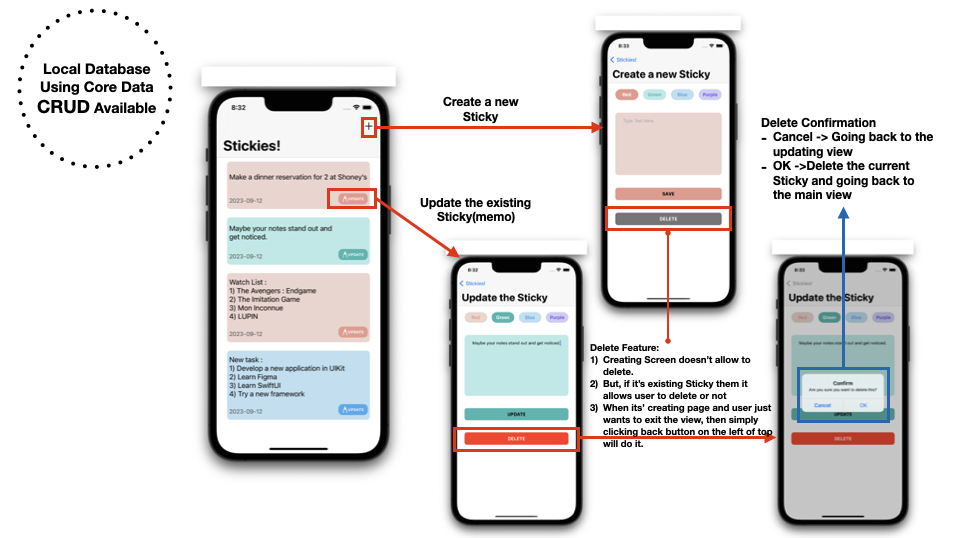

# Stickies - iOS

## Introduction

Stickies is a Todo List App inspired by the Stickies app on macOS. The color scheme is reminiscent of Stickies on macOS, and the application uses Core Data to create, read, update, and delete (CRUD) data. This app helps you keep track of your tasks and notes in a visually appealing way.

## Features

- Create new stickies
- Update existing stickies
- Delete stickies with confirmation
- Local database using Core Data
- MVC oriented architecture
- User-friendly UI with storyboard and Auto Layout

## Screenshots

## Concepts Utilized

- MVC oriented architecture
- Storyboard / Auto Layout
- Core Data for local storage

## Requirements

- iOS 16.2 or later
- Xcode 14.2 or later
- Swift 5.0 or later
