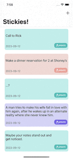

# Stickies - iOS

- Plaform: iOS
- Language: Swift
- Framework: UIKit

## Introduction

This is a Todo List App inspired by MacOS App Stickies.
So the colour scheme is somewhat similar to Stickies on MacOS.
The application use Core Data to create, read, update and delete(CRUD) datas.

# Concepts Utilized

- MVC oriented architecture
- Storyboard / Autolayout
- CoreData

## Requirements

- iOS(Deployment Target) 16.2 +
- Xcode 14.2 +
- Swift 5.0 +
